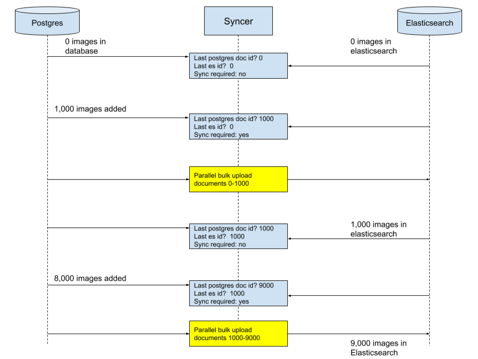

# Ingestion server

## Introduction

Ingestion Server is a small private API for copying data from an upstream source
and loading it into the Openverse API. This is a two-step process:

1. The data is copied from the upstream catalog database and into the downstream
   API database.
2. Data from the downstream API database gets indexed in Elasticsearch.

Performance is dependent on the size of the target Elasticsearch cluster,
database throughput, and bandwidth available to the ingestion server. The
primary bottleneck is indexing to Elasticsearch.

## How indexing works



## Safety and security considerations

The server has been designed to fail gracefully in the event of network
interruptions, full disks, etc. If a task fails to complete successfully, the
whole process is rolled back with zero impact to production.

The server is designed to be run in a private network only. You must not expose
the private Ingestion Server API to the public internet.

## Notifications

If a `SLACK_WEBHOOK` variable is provided, the ingestion server will provide
periodic updates on the progress of a data refresh, or relay any errors that may
occur during the process.

## Data refresh limit

The `DATA_REFRESH_LIMIT` variable can be used to define a limit to the number of
rows pulled from the upstream catalog database. If the server is running in an
`ENVIRONMENT` that is not `prod` or `production`, this is automatically set to
100k records.

## Running on the host

1. Create environment variables from the template file.

   ```bash
   just env
   ```

2. Install Python dependencies.

   ```bash
   just install
   ```

3. Start the Gunicorn server.
   ```bash
   pipenv run gunicorn
   ```

## Running the tests

### Integration Tests

The integration tests can be run using `just ingestion_server/test-local`. Note
that if an `.env` file exists in the folder you're running `just` from, it may
interfere with the integration test variables and cause unexpected failures.

### Making requests

To make cURL requests to the server

```bash
pipenv run \
  curl \
    --XPOST localhost:8001/task \
    -H "Content-Type: application/json" \
    -d '{"model": <model>, "action": <action>}'
```

Replace `<model>` and `<action>` with the correct values. For example, to
download and index all new images, `<model>` will be `"image"` and `<action>`
will be `"INGEST_UPSTREAM"`.

## Configuration

All configuration is performed through environment variables. See the
`env.template` file for a comprehensive list of all environment variables. The
ones with sane defaults have been commented out.

Pipenv will automatically load `.env` files when running commands with
`pipenv run`.

## Mapping database tables to Elasticsearch

In order to synchronize a given table to Elasticsearch, the following
requirements must be met:

- The database table must have an autoincrementing integer primary key named
  `id`.
- A SyncableDoctype must be defined in `es_syncer/elasticsearch_models`. The
  SyncableDoctype must implement the function
  `database_row_to_elasticsearch_model`.
- The table name must be mapped to the corresponding Elasticsearch
  SyncableDoctype in `database_table_to_elasticsearch_model` map.

Example from `es_syncer/elasticsearch_models.py`:

```python
class Image(SyncableDocType):
    title = Text(analyzer="english")
    identifier = Text(index="not_analyzed")
    creator = Text()
    creator_url = Text(index="not_analyzed")
    tags = Text(multi=True)
    created_on = Date()
    url = Text(index="not_analyzed")
    thumbnail = Text(index="not_analyzed")
    provider = Text(index="not_analyzed")
    source = Text(index="not_analyzed")
    license = Text(index="not_analyzed")
    license_version = Text("not_analyzed")
    foreign_landing_url = Text(index="not_analyzed")
    meta_data = Nested()

    class Meta:
        index = 'image'

    @staticmethod
    def database_row_to_elasticsearch_doc(row, schema):
        return Image(
            pg_id=row[schema['id']],
            title=row[schema['title']],
            identifier=row[schema['identifier']],
            creator=row[schema['creator']],
            creator_url=row[schema['creator_url']],
            created_on=row[schema['created_on']],
            url=row[schema['url']],
            thumbnail=row[schema['thumbnail']],
            provider=row[schema['provider']],
            source=row[schema['source']],
            license=row[schema['license']],
            license_version=row[schema['license_version']],
            foreign_landing_url=row[schema['foreign_landing_url']],
            meta_data=row[schema['meta_data']],
        )


# Table name -> Elasticsearch model
database_table_to_elasticsearch_model = {
    'image': Image
}
```

## Deployment

This codebase is deployed as a Docker image to the GitHub Container Registry
[ghcr.io](https://ghcr.io). The deployed image is then pulled in the production
environment. See the [`ci_cd.yml`](../.github/workflows/ci_cd.yml) workflow for
deploying to GHCR.

The published image can be deployed using the minimal
[`docker-compose.yml`](docker-compose.yml) file defined in this folder (do not
forget to update the `.env` file for production). The repository `justfile` can
be used, but the environment variable `IS_PROD` must be set to `true` in order
for it to reference the production `docker-compose.yml` file here. The version
of the image to use can also be explicitly defined using the `IMAGE_TAG`
environment variable (e.g. `IMAGE_TAG=v2.1.1`).

### Old Docker Hub images

- [openverse/ingestion_server](https://hub.docker.com/r/openverse/ingestion_server)
- [creativecommons/ingestion_server](https://hub.docker.com/r/creativecommons/ingestion_server)
